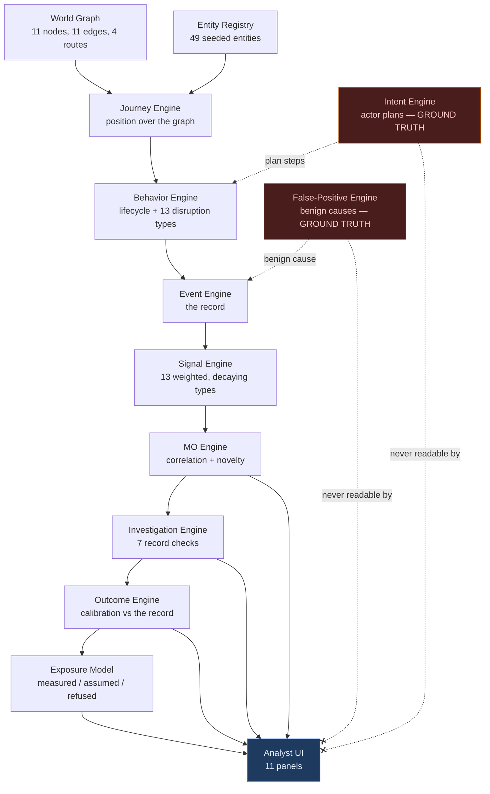
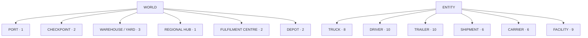

<p align="center"></p>

# Fraud Watch

## A Living Freight-Fraud Investigation Simulator

**An autonomous freight-network simulation where operational behavior becomes observable evidence,
signals are correlated into investigations, and fraud hypotheses emerge — without ever exposing the
simulation's ground truth to the analyst.**

Fraud Watch runs a small freight network on its own: trucks, drivers, trailers and carriers move over
a real topology, disruptions happen, and most of them are innocent. The analyst sees only what was
*recorded*. What actually happened — which actor had a plan, which anomaly had a benign cause — is
held in the simulation and is structurally unreachable from every analyst-facing surface.

**[▶ Live demo](https://jeevan-0508.github.io/fraud-watch/)** ·
[Architecture](#architecture) ·
[Investigation model](#the-investigation-model) ·
[Case study](docs/case-study.md) ·
[Interview story](docs/interview-story.md)

> Open the demo and choose the **Live Sim** tab — that is the simulation described below.
> The other two tabs (*Classic Watch*, *Port Meridian*) are earlier arcade-style front ends kept for
> continuity; they are not what this project is about.

---

```
                        F R A U D   W A T C H
              LIVING FREIGHT-RISK SIMULATION ENVIRONMENT

         OBSERVABLE BEHAVIOR  ->  SIGNALS  ->  INVESTIGATION

              PORT ── GATE ── HUB ── FC ── DEPOT ── YARD
                 11 nodes · 11 road edges · 4 routes

   autonomous movement    operational signals    correlated cases
   deterministic replay   false positives        hidden ground truth
```

| | |
|---|---|
| **What it is** | Deterministic, seeded simulation of a freight network plus the analyst tooling to investigate it |
| **What it is not** | Not production software, not a live data feed, not machine learning |
| **Scale** | 11 nodes · 11 edges · 4 routes · 49 seeded entities · 13 disruption types · 13 signal types |
| **Code** | 55 JavaScript modules, 20,600 lines, no build step, no backend |
| **Verification** | 112 external test suites, 0 failing, at the current commit |
| **Fraud content** | 12 documented patterns / 77 indicators / 137 countermeasures / 31 false positives, from a public taxonomy |

---

## Why I built this

Most fraud demonstrations assume a shape that real investigations never have:

```
event  ->  fraud
```

An actual investigator does not receive events labelled fraud. They receive observations, noise,
false positives, partial evidence, awkward timing, behavior over weeks, and relationships between
entities — and they have to decide something anyway, knowing they may be wrong.

Fraud Watch was built to model that gap rather than skip over it. Its central design commitment is
one sentence:

> **Fraud Watch separates what actually happened in the simulation from what an analyst is allowed
> to observe.**

That separation is not a slogan in this repository. It is a declared property of specific modules,
and it is checked by the test suite (see [Engineering discipline](#engineering-discipline)).

## What makes it different

| Typical fraud demo | Fraud Watch |
|---|---|
| Static dataset | Autonomous world that runs on its own clock |
| Binary fraud label attached to a row | No label anywhere on the analyst's side |
| Isolated transactions | Real journeys over a typed node/edge graph |
| No persistent entities | Trucks, drivers, trailers, carriers with history |
| Every anomaly is fraud | ~2 in 3 anomalies carry a documented benign cause |
| No correlation | Two distinct signal types and a weight threshold before a case exists |
| No investigation | Seven record-checking actions that cost effort and can return nothing |
| Ground truth visible in the data | Actor intent and act-linkage unreachable from the UI by design |
| Non-reproducible | Same seed, same run, every time |

## The core model

Each layer only consumes what the layer above it recorded. Nothing skips ahead.

```
WORLD           a typed graph of places and roads
   |
ENTITIES        trucks, drivers, trailers, shipments, carriers, facilities
   |
JOURNEYS        a truck is at a named node, or a stated fraction along a named road
   |
BEHAVIOR        a lifecycle advances; occasionally something is disrupted
   |
EVENTS          the disruption is written down as a record, with no interpretation
   |
SIGNALS         the record becomes a weighted, time-bounded observation
   |
CORRELATION     several distinct live signals on one entity may form a case
   |
INVESTIGATION   the analyst spends effort pulling records that may or may not exist
   |
MO/HYPOTHESIS   the case is matched against documented fraud patterns, or flagged as novel
   |
DECISION        the analyst closes it — confirmed, false positive, dismissed, resolved
   |
CONSEQUENCE     the call is scored against the record, and the effort is priced
```

**World** — a declared topology of ports, gates, yards, hubs, fulfilment centres and depots, with
distances on the roads between them.
**Entities** — a persistent population. The same driver is still the same driver next week, which is
what makes a pattern possible at all.
**Journeys** — position is a fact derived from movement, not a random draw. A truck cannot be at two
places with no road between them.
**Behavior** — trucks advance through a nine-stage lifecycle; on a small per-tick probability
something is disrupted.
**Events** — a disruption becomes a record. The record says *what was observed*, never *what it
means*.
**Signals** — a record is weighted and given a lifetime. Old observations stop counting, exactly as
stale intelligence does.
**Correlation** — one strong signal is deliberately not enough. A case needs at least two *different
kinds* of live signal and enough combined weight.
**Investigation** — checking a record source costs simulated hours and can come back exculpatory,
weakly corroborating, inconclusive, or "no such record is produced here".
**MO / hypothesis** — the case is compared against a real published taxonomy of freight fraud
patterns; if nothing matches, that is reported as a gap in the vocabulary, not as a finding.
**Decision** — a human closes the case. The system never closes one for you.
**Consequence** — the verdict is compared with what the simulation actually recorded, and reported as
calibration, never as a grade.

## The digital world

The topology is declared in one place and everything else is derived from it.

**11 nodes** — 1 port, 2 checkpoints (gates), 3 yards, 1 regional hub, 2 fulfilment centres, 2 inland
depots.
**11 undirected road edges** — each with a declared distance, from 0.3 km inside the port to 74 km
between the south gate and Inland Depot Sud.
**4 routes** — ordered node sequences; every consecutive pair is validated at load time against an
edge that actually exists.
**9 facilities** seeded across those nodes — which means **4 of the 11 nodes carry no facility at
all, and therefore have no observation coverage.** That is stated in the code and surfaced in the UI
rather than quietly averaged away.
**49 entities** — 8 trucks, 10 drivers, 10 trailers, 6 shipments, 6 carriers, 9 facilities.
**9 lifecycle stages** — dispatched, en route to port, checkpoint, loading, departure, transit,
depot, delivery, completed. Which stages can occur at which node types is declared once.

Everything in that graph is invented. It describes no real port, facility, road or lane, and no real
network was used as a template. Travel time is distance divided by one of two constant speed
classes — so a duration in this world carries no information the distance does not already carry, and
a delay *cannot* be derived from it. The code says so explicitly, in the same place it exports the
number.

## The investigation model

```
OBSERVATION      something happened and was recorded
     |
SIGNAL           weighted, with a lifetime
     |
CORRELATED       >= 2 distinct live signal types on one entity, over a weight threshold
     |
CASE             a structured object with evidence, entities and a status
     |
INVESTIGATION    record checks that cost effort and can fail
     |
HYPOTHESIS       resembles a known pattern / a variant / possibly new / unrecognised
     |
DECISION         a human call, scored against the record afterwards
```

> ## SIGNAL ≠ FRAUD
>
> A signal says *"this happened, here is how strong it is and how long it stays relevant."*
> It does not say anyone did anything wrong. Every layer of this project is arranged so that
> nothing can quietly promote an observation into an accusation.

This is enforced structurally, not by convention:

- **The behavior engine does not know the word "suspicious".** It emits plain facts —
  *driver changed*, *route deviated* — and cannot label them.
- **A single strong signal cannot open a case.** The correlation engine requires two distinct signal
  kinds *and* a combined weight over threshold. A chain, not one repeated blip.
- **Evidence expires.** Signals decay, so a case must be built out of observations that were actually
  in the room together.
- **Absence of an innocent explanation is not evidence of guilt.** A *documented* benign record
  (a logged maintenance swap, a rostered handover) is verifiable and pushes confidence down hard. The
  mere absence of such a record pushes it up by deliberately much less, and the narrative says so in
  words.
- **Investigating is not an oracle.** A check can be inconclusive, or hit a site that structurally
  does not produce that kind of record. You spend the effort and learn nothing — which is why a wrong
  escalation remains possible.

## Fraud intelligence

Cases are classified by how their *signal signature* — the sorted set of distinct signal types —
compares with everything seen before in the run and with a published taxonomy:

| Classification | Meaning |
|---|---|
| `KNOWN_MO` | A recurring signature, seen many times before |
| `MO_VARIANT` | Strongly resembles a documented pattern, but this exact combination has not recurred |
| `POTENTIAL_NEW_MO` | Some resemblance to something known, but rare or new |
| `EMERGING_BEHAVIOR` | No confident resemblance to anything documented |

Pattern matching is an explicit **heuristic**, and the code is blunt about it: it picks the taxonomy
pattern whose name, category and aliases best resemble the observed signal kinds. It never invents a
pattern, and it never claims a simulated signal literally *is* a documented indicator. When nothing
shares a keyword, that is reported as a gap in the taxonomy's vocabulary — not as a finding about the
behavior.

The taxonomy itself is real, public, and quoted verbatim: **12 fraud patterns, 77 indicators, 137
countermeasures, 31 documented false positives** across 8 categories, from
[freight-fraud-taxonomy](https://github.com/Jeevan-0508/freight-fraud-taxonomy) (CC BY 4.0). Counts
are verified against `data/fraud-data.json` rather than asserted.

A **network view** builds an entity co-occurrence graph from cases that already exist. An edge means
"these two appeared in a case together" — a fact about the simulation's history, not an allegation.
Facilities are drawn but deliberately excluded from repeat-entity and clustering findings, because
almost every movement passes through a gate: a site's degree measures traffic, not involvement.

### Actor intent is ground truth, and the analyst cannot reach it

Some drivers hold a **plan**: an ordered list of steps, each pairing a disruption type with a
position test over the world graph. A step fires only when that driver's truck is genuinely in that
position, and only on an opportunity the behavior engine had already granted at its own unchanged
rate. So a plan changes *which* disruption a granted opportunity spends itself on — never how many
there are.

The plan is ground truth. The module that owns it **declares its own permitted readers in code**:

- **May read it:** the behavior engine, and the simulation runner.
- **Must not read it:** *any* file under `js/ui/`, and every engine downstream of behavior — signal,
  correlation, investigation, outcome, exposure, analytics, network, reporting, advice.

The stated reason: *"a case is supposed to be built out of what was written down. A classifier that
could read the plan would be scoring itself, and a panel that could render it would be answering the
question the player is here to answer."*

A planned disruption is annotated with a possible benign cause **identically** to an unplanned one.
Roughly two in three planned disruptions therefore carry an innocent explanation on record. A plan is
not a label.

## False-positive design

False positives are not an edge case here. They are the majority of the population, because that is
how operational risk actually behaves.

```
NORMAL BEHAVIOR
      |
ANOMALY                    something odd is recorded
      |
SIGNAL                     weighted, time-bounded
      |
CORRELATION                enough distinct evidence to be worth a case?
      |
INVESTIGATION              pull the records
      |
TRUE POSITIVE  /  FALSE POSITIVE  /  DISMISSED  /  AMBIGUOUS
```

About **65%** of disruptions are generated with a documented innocent cause — congestion reroutes,
rostered shift handovers, logged telematics outages, maintenance swaps. The system never assumes an
anomaly is fraud, and the vocabulary refuses to let it drift:

- A case's recorded state is `FULLY_EXPLAINED`, `PARTIALLY_UNEXPLAINED`, or `UNEXPLAINED`.
- **`UNEXPLAINED` is not "fraud".** It means the simulation holds no innocent explanation — an
  absence in the records, not a proven act.
- A partially explained case is **`AMBIGUOUS` by construction**, and is excluded from every accuracy
  rate, because neither closing verdict was unreasonable on that evidence.
- Analyst verdicts are scored `ALIGNED` / `OVERCALLED` / `UNDERCALLED` / `AMBIGUOUS` **against the
  record**. Nothing in this project ever tells the analyst they were right or wrong about the world.

## Risk and governance thinking

The parts of this project I would actually defend in a risk review:

**Observability is modelled, not assumed.** Recording varies by shift and by site. Night is quiet
partly because less moves and partly because less of what happens gets written down. Every observed
count is shown beside the coverage that produced it — never alone.

**Observation bias is surfaced, not corrected away.** Sort sites by recorded disruptions and the top
of the list is the *best-watched* site. So the raw and coverage-adjusted orderings are shown side by
side, disagreements are called out, and a card of equal visual weight states that neither ordering is
a risk ranking and that the adjustment cannot fix the bias it illustrates.

**Every rate declares its denominator — or it cannot exist.** The metric constructor *throws* if the
denominator is not stated in words. On a dashboard, six percentages in six identical tiles read as
six comparable measurements whatever the caption says; in this simulation they are not comparable, so
each one carries its n / N and what N counts.

**Refusals are first-class output.** Expected loss, loss avoided, the cost of a false accusation,
recovery and insurance are all deliberately *not* computed, and the panel says so at the same visual
weight as the numbers it does show — because computing them would need either a probability of loss
or an unobservable counterfactual. Exposure means "what was at stake", never "what was lost", and it
cannot be rendered without the words that say so. Money is never shown without the measured hours and
the stated assumed rate that produced it.

**Provenance and auditability.** Numbers are separated by epistemic status — *measured* (investigative
effort actually recorded), *assumed* (rates and value bands, labelled at the point of use), and
*refused*. Every engine ships an `ASSUMPTIONS` and a `NOT_MODELLED` register, in code, next to what
it exports.

**Reproducibility.** The whole run is seeded. Same seed, same events, same cases. A simulation that
cannot be replayed cannot be argued with.

**Human in the loop.** No case closes itself. The system supports a decision and then holds up a
calibration mirror; it never makes the call.

## Architecture



The two red boxes are the simulation's answer key. The dotted arrows into the record are how they act
on the world; the crossed arrows are the boundary the test suite enforces.



## Technical highlights

| Capability | What it demonstrates |
|---|---|
| Canonical world graph, validated at load | Domain modelling, single source of truth |
| Journeys with real position over that graph | State consistency across engines |
| Seeded deterministic simulation | Reproducibility, replayable evidence |
| Autonomous behavior + actor plans | Modelling actors, not rows |
| 13-type weighted, decaying signal catalog | Risk observability with a lifetime |
| Two-bar correlation before a case exists | Investigation logic, precision discipline |
| Novelty classification against a real taxonomy | Fraud pattern reasoning |
| 65% benign-cause generation | False-positive realism |
| Declared reader lists on ground-truth modules | Governance enforced in code |
| Denominator-or-throw metric construction | Numerical honesty |
| `ASSUMPTIONS` / `NOT_MODELLED` on every engine | Auditability |
| 112 external test suites | Product verification, not just "it runs" |

Stack: plain HTML/CSS/JavaScript, no build step, no bundler, no backend, no `package.json`. Tailwind,
Chart.js and Phaser 3 come from CDN; nothing is installed. Modules are classic scripts published
through one explicit registry (`js/globals.js`) that **throws** if any of the 53 expected modules is
missing — because a silently absent module used to mean every optional-dependency guard quietly took
its fallback branch.

## Engineering discipline

The test suite does not only check whether the application runs. It checks whether the analyst can
accidentally learn something they should not, whether the engines agree with each other about the same
simulated fact, and whether the visual layer can invent state the simulation never produced.

**112 suites, 0 failing**, verified by a full regression run at the current commit. What they
deliberately attack:

- **Ground-truth leakage** — source scans assert that no file under `js/ui/` and no downstream engine
  reads an actor's plan or the per-event answer key. Complemented by dynamic checks that install
  throwing getters on those fields and then render every panel: if anything so much as *touches* the
  answer key, the render throws.
- **Answer-key vocabulary** — banned words and leak tokens are owned by the application
  (`js/ui/copy-rules.js`), with a declared reason for each, scanned across rendered copy *including*
  `title`, `alt` and `aria-label`, since a tooltip is text a reader actually reads.
- **Semantic ambiguity** — two different quantities in this codebase are both called `severity` (a
  taxonomy harm class, and a record of whether anything was disrupted), and two are called `weight`.
  Each scale is declared where it lives and checked against its own declaration, so a taxonomy harm
  class cannot be summed into a correlation score.
- **Display refusals** — six formatting functions refuse to render a value that is off the scale their
  own output string asserts. `"250 / 100"` is not allowed to be printed.
- **State consistency** — lifecycle stage, journey position and facility assignment must agree; a
  truck cannot appear at two sites with no road between them.
- **Topology integrity** — every route is validated against edges that exist, so a typo cannot
  produce a plausible-looking journey over a road that is not there.
- **UI truthfulness** — every element id a module asks for must actually exist in `index.html`, and
  sit inside the panel it claims to render into. The DOM shim fabricates elements for any id, so a
  misspelling would otherwise pass every other check while the real page rendered into nothing.
- **Determinism** — two runs from one seed must produce identical event totals and an identical case
  population.

Two habits behind that list are worth naming, because they cost the most and mattered the most.
First, **a number in a comment is a claim, and gets measured.** The project has repeatedly found that
a documented figure had drifted from the code, and the fix has always been to measure and correct the
document rather than soften the wording. Second, **a shape guaranteed by construction is not a
finding** — a single-case clique in a network graph, or a cluster merged through a gatehouse, is an
artefact of how the graph was built, and is excluded from findings rather than reported as insight.

## Current system

Verified against the current commit by reading the code and by loading the deployed application.

| Capability | Status |
|---|---|
| Canonical world graph (11 nodes / 11 edges / 4 routes) | Complete |
| Entity registry and seeded population (49 entities) | Complete |
| Truck journeys with real position over the graph | Complete |
| Autonomous lifecycle behavior + 13 disruption types | Complete |
| Actor intent / plans (ground truth) | Complete |
| Composite acts (one act, multiple records) | Complete — engine only, deliberately not rendered |
| Event stream (13 normal types, bounded 5,000-entry ring buffer) | Complete |
| Signal generation (13 weighted, decaying types) | Complete |
| Signal correlation into cases (two-bar threshold) | Complete |
| MO / novelty classification against the taxonomy | Complete |
| False-positive generation with documented causes | Complete |
| Investigation actions (7 record checks, costed) | Complete |
| Verdict scoring / analyst calibration | Complete |
| Exposure and cost model (measured / assumed / refused) | Complete |
| Portfolio analytics with declared denominators | Complete |
| Shift and site observation-coverage modelling | Complete |
| Entity co-occurrence network view | Complete |
| Live network map with entity read-out and event strip | Complete |
| MO Intelligence Center (filterable case queue + detail) | Complete |
| "While you were away" reporting | Complete |
| Classic Watch arcade mode | Complete |
| Port Meridian investigation mode | Vertical slice — missions and free-roam not built |
| Long-run replay / scenario comparison | Not built — the event log is a bounded ring buffer, so old events are discarded |
| Machine learning of any kind | Not present, and not claimed |

## Live demo

**[jeevan-0508.github.io/fraud-watch](https://jeevan-0508.github.io/fraud-watch/)** — static, no
sign-in, nothing to install.

Select the **Live Sim** tab, then:

1. **Watch the Live Freight Network.** Eleven places, eleven roads, trucks sitting where their own
   journeys say they are. Nothing is animated between simulation steps, so a marker moves only when
   the world does.
2. **Note what the picture refuses to tell you.** The drawn length of a road is a consequence of the
   layout; the real distance is printed on the road.
3. **Find a truck with a dashed amber ring.** It carries at least one live signal — an observation
   with a lifetime, not a finding.
4. **Click it.** The read-out appears beside the map: its driver, trailer and carrier, its live
   signals with their decay wording, and its open/closed case counts.
5. **Read the event strip underneath.** When, what type, against which entity — and nothing about
   why any of it happened.
6. **Open the MO Intelligence Center.** Every case that has ever existed, filterable by status and by
   novelty classification. Nothing disappears because its evidence faded.
7. **Open a case and run record checks.** Watch an exculpatory finding move confidence far more than
   a corroborating one, and watch a check come back with nothing at all.
8. **Close it, then open Analyst Calibration.** See your call scored against the record — and see the
   panel withhold percentages until there are enough decided cases to mean anything.
9. **Compare the operational world with the intelligence layer.** The Sites panel will show you that
   the busiest site is the best-watched one, not the riskiest.

Speed controls and a fast-forward are in the Live Sim header if you do not want to wait for the world
to produce something.

## Demo video

**No demo video exists yet.** Rather than fake one, here is the plan for a 90–150 second capture,
built only from what the application actually does today:

| Time | Shot | What it proves |
|---|---|---|
| 0–10s | The Live Freight Network at 5× — eleven nodes, eleven roads, trucks at their positions | This is a world, not a dashboard |
| 10–30s | Fast-forward; markers step between nodes and along legs; distance labels visible | Movement is derived from a real topology |
| 30–50s | An event lands in the strip — timestamp, type, entity, and no explanation | A record says what, never why |
| 50–75s | A truck gains a dashed amber ring; click it; the read-out shows live signals and decay wording | Signal ≠ fraud, and evidence expires |
| 75–100s | MO Intelligence Center: a case with two distinct signal types; open it; run two record checks — one exculpatory, one inconclusive | Investigation costs effort and can fail |
| 100–120s | Close the case; Analyst Calibration shows the verdict scored against the record, with counts not percentages | Calibration, not grading |
| 120–150s | Sites & Observation Bias, raw vs coverage-adjusted, and the refused-figures card; hold on the architecture diagram | Observation bias and refusals are the point |

Capture at 1600×1000 or wider, no music, and no cut that implies a capability which is not on screen.

## Screenshots

**Not yet captured.** The five that would carry the most weight, and what each is there to prove:

| # | Shot | What it proves |
|---|---|---|
| 1 | Live Freight Network, several trucks placed, one with an active-signal ring | A world exists and is running |
| 2 | Truck selected — in-map read-out with linked entities and live signals | Entities are persistent and inspectable |
| 3 | An open case in the MO Intelligence Center with its evidence chain and record-check findings | Investigation is real work with real failure modes |
| 4 | Novelty classification, plus the matched taxonomy pattern with its documented false positives | Fraud reasoning against published patterns |
| 5 | Sites & Observation Bias — raw beside coverage-adjusted, with the refused card | Risk maturity: the bias is shown, not corrected away |

*These need capturing on a full-width display and are not in the repository yet. No image is linked
above, so nothing here renders broken.*

## Real-world relevance

Potential applications of the approach, stated as potential rather than deployed:

- Freight and carrier fraud investigation tooling
- Logistics and transportation risk monitoring
- Transportation security and cargo-loss analysis
- Anomaly triage where most anomalies are benign
- Operational risk and control monitoring design
- Fraud analyst training and onboarding
- Risk scenario testing against a reproducible world
- Governance and control design review — particularly how observability bias distorts a risk ranking

## Privacy and data

- **No Amazon confidential data is in this repository.** None, in any commit.
- **No customer or personal data. No PII. No credentials of any kind.**
- All simulation data is **synthetic**. Entity names, carriers, sites, roads and distances are
  invented and describe no real network.
- The fraud taxonomy in `data/fraud-data.json` is a **public, published** dataset compiled from open
  sources, quoted verbatim under CC BY 4.0.
- Six of the thirteen behavioral primitives were **generalized once**, manually, from real operational
  freight-fraud investigation patterns: read for behavioral shape only, with every identifying
  detail — carrier names, identifiers, case IDs, dates, amounts, names, coordinates, source
  links — discarded before anything was written down. No raw data was ever committed, cached, or
  processed by a script in this repository. The full provenance note, including a correction where an
  earlier reading of that source was wrong, is in
  [`docs/real-world-mo-ingestion.md`](docs/real-world-mo-ingestion.md).

## Limitations

Stated plainly, because a risk project that hides its limitations is making a claim about itself that
it has not earned.

- **This is a simulation, not production telemetry.** No live carrier feeds, no real logistics
  integrations, no real-time data of any kind.
- **There is no machine learning.** Not a neural network, not a classifier, not a model. Every
  decision boundary is a declared rule or a seeded probability, and the project would rather say so
  than borrow the word.
- **It is not a production fraud-decisioning system** and has never been used to make a real decision
  about a real carrier, shipment or person.
- **World scale is intentionally bounded** — 11 nodes and 49 entities. The caseload is correspondingly
  thin. That is a structural consequence of an honest correlation threshold, and raising the
  disruption rate to manufacture cases is the exact failure mode this project exists to avoid.
- **Travel time carries no information beyond distance.** There is no congestion, weather, queueing or
  driver-hours variability, so a delay cannot be derived from a traverse duration.
- **Long runs cannot be replayed.** The event log is a bounded 5,000-entry ring buffer; older events
  are discarded, so a 20-day run cannot be reconstructed after the fact.
- **The taxonomy is static.** It is a versioned snapshot of a published dataset, not a live feed, and
  its severity and prevalence judgements are that taxonomy's qualitative assessment.
- **Composite acts are modelled but not rendered.** The engine links the records an act leaves behind;
  the UI deliberately does not surface them yet.
- **Port Meridian is a vertical slice.** Missions, free-roam, day/night cycle and audio are not built.
- **The demo's default tab is the arcade mode**, which undersells everything above. Choose Live Sim.
- **Modelling a regulatory or control concept is not compliance with it.** Nothing here certifies
  anything.

## Roadmap

1. **Case-scoped evidence retention** so a long investigation can outlive a ring buffer — without
   quietly widening a decay window to fake correlation.
2. **Scenario comparison** — run two seeds side by side and compare what an analyst could have known.
3. **Surface composite acts** in the UI, now that the engine links the records an act leaves behind.
4. **Richer autonomous network behavior** — dispatch decisions that respond to the state of the world
   rather than advancing a lifecycle.
5. **An explicit analyst training mode** with a debrief against the record.

## Professional context

Built as an independent risk-technology project by an enterprise Risk Management professional
exploring the intersection of operational risk, fraud intelligence, governance and software systems.

I work in freight and carrier risk, where the daily problem is not *"is this fraud"* but *"what can I
actually observe, how much of it is noise, and what am I entitled to conclude."* Fraud Watch is my
attempt to build that problem rather than describe it — and the parts I am most pleased with are the
refusals: the figures this system declines to compute, and the boundary the tests keep the analyst on
the right side of.

**Jeevan Siddhabhaktula** ·
[LinkedIn](https://www.linkedin.com/in/jeevan-siddhabhaktula-6927041a2) ·
jeevansiddhabhaktula@gmail.com

Further reading: [case study](docs/case-study.md) ·
[interview story](docs/interview-story.md) ·
[positioning notes](docs/linkedin-launch.md) ·
[architecture audit](docs/architecture-audit.md) ·
[data provenance](docs/real-world-mo-ingestion.md)

## License

Application code: **MIT** — see [LICENSE](LICENSE).
Fraud taxonomy content (`data/fraud-data.json`): **CC BY 4.0**, from
[freight-fraud-taxonomy](https://github.com/Jeevan-0508/freight-fraud-taxonomy). Use it, adapt it,
cite it.

Not legal or operational advice. Severity, prevalence and countermeasures reflect the source
taxonomy's qualitative judgement about European road freight, not a proprietary detection model.

---

<sub>**Topics:** fraud investigation · fraud detection · risk management · risk intelligence · freight
risk · logistics risk · supply chain risk · transportation security · GRC · risk technology · risk
governance · anomaly detection · false positives · investigation workflow · deterministic simulation ·
behavioral analytics · decision support · JavaScript</sub>
